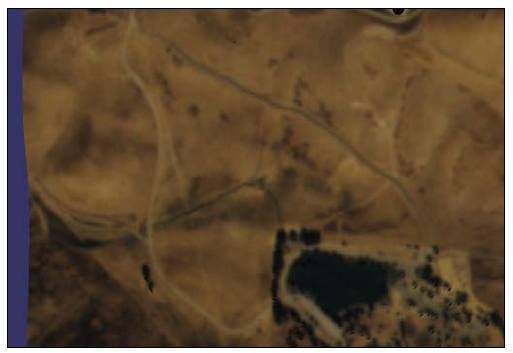

Chapter 4: Manipulating Everything
==================================

在本章中我们将会探讨：

-  在多屏幕上设置视图
-  使用辅助相机模拟power-wall
-  使用深度分解来显示巨型场景
-  实现雷达映射
-  显示模型的顶，前与侧视图
-  操作顶，前与侧视图
-  跟随移动的模型
-  使用操作器来跟随模型
-  设计2D相机操作器
-  使用操纵杆操作视图

Introduction
------------

本章全部是关于相机与相机操作的。无论我们的场景多么漂亮与真实，糟糕的浏览体验也会吓跑我们的用户。我们的目标是试着修改表示3D空间变换的视图与投影矩阵，从而平滑与舒适的改变我们由相机所看到的世界。不要忘记使用鼠标与键盘操作实际上是2D交互，具有2自由度（DOF）以及鼠标按钮。所以，使用鼠标移动与按钮点击事件，我们很描述一个完整的3D运动（共6自由度）。

幸运的是，OSG为我们提供了大量的内建相机操作器，例如osgGA::TrackballManipulator。他同时包含一个良好的框架（包括操作器基类与事件处理器）用于实现我们自己的浏览策略。我们将会在特定的章节探讨所有这些特性。

在这里另一个有趣的主题是单视图与组合视图的使用，以及查看属性与多监视器选项的配置。我们在后续的章节中会看到这些示例。

Setting up views on multiple screens
------------------------------------

今天，越来越多的人在工作时拥有多个物理显示设备，特别是多个监视器（或屏幕）。当今的现代图形卡总是至少提供两个输出。同时，大多数的操作系统已经对多屏幕的并行使用提供了完整的支持，包括Linux，Mac
OSX与Microsoft Windows。

然而，对多屏幕进行统带依然是一个挑战，因为开发不得不自己处理每个屏幕的图形缓冲区，这对于许多没有太多经验的开发者非常痛苦。幸运的是，OSG封装了平台相关的多监视器API并且使用环境ID来表屏幕。他使得用户在每个屏幕上可以创建并使用一个或多个图形环境，而编写OSG程序不再感到困难。

How to do it...
~~~~~~~~~~~~~~~

完成本节需要遵循下列步骤：

1. 包含必须的头文件：

.. raw:: html

   <!-- -->

::

    #include <osg/Camera>
    #include <osgDB/ReadFile>
    #include <osgGA/TrackballManipulator>
    #include <osgViewer/CompositeViewer>

2. createView()函数将会在特定的屏幕上创建全屏幕窗口：

.. raw:: html

   <!-- -->

::

    osgViewer::View* createView( int screenNum )
    {
      ...
    }

3. 让我们在函数中依据当前的屏幕设置配置所需要的渲染窗口属性。我们可以通过调用WindowingSystemInterface类获取所需要的屏幕尺寸与属性：

.. raw:: html

   <!-- -->

::

    unsigned int width = 800, height = 600;
    osg::GraphicsContext::WindowingSystemInterface* wsi = osg::Graphic
    Context::getWindowingSystemInterface();
    if ( wsi )
        wsi->getScreenResolution( osg::GraphicsContext:: 
    ScreenIdentifier(screenNum), width, height );
    osg::ref_ptr<osg::GraphicsContext::Traits> traits = new 
    osg::GraphicsContext::Traits;
    traits->screenNum = screenNum;
    traits->x = 0;
    traits->y = 0;
    traits->width = width;
    traits->height = height;
    traits->windowDecoration = false;
    traits->doubleBuffer = true;
    traits->sharedContext = 0;

4. 构建图形环境并将其关联到相机来提供一个可用的渲染窗口。相机的视口也应该接收尺寸参数来在全屏幕范围内显示场景：

.. raw:: html

   <!-- -->

::

    osg::ref_ptr<osg::GraphicsContext> gc = osg::GraphicsContext::crea
    teGraphicsContext( traits.get() );
    if ( !gc ) return NULL;
    osg::ref_ptr<osg::Camera> camera = new osg::Camera;
    camera->setGraphicsContext( gc.get() );
    camera->setViewport( new osg::Viewport(0, 0, width, height) );
    camera->setProjectionMatrixAsPerspective(
        30.0f, static_cast<double>(width)/static_cast<double>(height), 
    1.0f, 10000.0f );
    GLenum buffer = traits->doubleBuffer ? GL_BACK : GL_FRONT;
    camera->setDrawBuffer( buffer );
    camera->setReadBuffer( buffer );

5. 创建一个新的视图对象，设置默认的相机操作器并最后返回：

.. raw:: html

   <!-- -->

::

    osg::ref_ptr<osgViewer::View> view = new osgViewer::View;
    view->setCamera( camera.get() );
    view->setCameraManipulator( new osgGA::TrackballManipulator );
    return view.release();

6. 在主体部分，我们将会利用本节中的osgViewer::CompositeViewer类：

.. raw:: html

   <!-- -->

::

    osgViewer::CompositeViewer viewer;

7. 在第一个屏幕上创建一个显示任意模型的视图：

.. raw:: html

   <!-- -->

::

    osgViewer::View* view1 = createView( 0 );
    if ( view1 )
    {
      view1->setSceneData( osgDB::readNodeFile("cessna.osg") );
      viewer.addView( view1 );
    }

8. 在第二个屏幕上创建另一个视图。确保我们有足够的监视器并已经将其连接到我们的图形卡：

.. raw:: html

   <!-- -->

::

    osgViewer::View* view2 = createView( 1 );
    if ( view2 )
    {
      view2->setSceneData( osgDB::readNodeFile("cow.osg") );
      viewer.addView( view2 );
    }

9. 启动查看器：

.. raw:: html

   <!-- -->

::

    return viewer.run();

10. 如果我们至少有两上监视器，我们就会在主监视器上看到一个Cessna模型，而在另一个监视器上看到一个Cow模型；否则，我们只能正确的渲染主场景，而在控制台窗口我们看到一些失败信息，表明第二个视图不能被初始化。

How it works...
~~~~~~~~~~~~~~~

在createView()函数中，我们通过调用WindowingSystemInterface类可以很容易获取屏幕尺寸与其他属性，该类可以访问平台特定的窗口API。然后我们将所得到的宽度与高度值传递给一个Traits对象。当然，不要忘记screenNum值，这是在多显示器上设置多视图的关键。

在OSG中单屏幕与多屏幕编程的唯一区别在于设置Traits类的屏幕索引（screenNum）变量。与特定的平台相关的任何其他内容为OSG自动处理而屏幕信息将会由WindowingSystemInterface类进行记录。

There's more...
~~~~~~~~~~~~~~~

我们可以通过调用WindowingSystemInterface类的getNumScreens()方法来获取连接到当前计算机的屏幕数量：

::

    osg::GraphicsContext::WindowingSystemInterface* wsi =
        osg::GraphicsContext::getWindowingSystemInterface();
    if ( wsi ) numScreens = wsi->getNumScreens();

为了获取屏幕的详细信息（屏幕索引为num）：

::

    osg::GraphicsContext::ScreenSettings settings;
    osg::GraphicsContext::WindowingSystemInterface* wsi = osg::Graphic
    sContext::getWindowingSystemInterface();
    if ( wsi ) wsi->getScreenSettings(
        osg::GraphicsContext::ScreenIdentifier(num), settings );

我们可以由设置变量获取屏幕宽度，高度，刷新频率以及颜色缓冲区深度属性。

核心源码中的osgcamera示例可以精确解释如何使用屏幕数字标识符在单个与多个屏幕上显示场景。

Using slave cameras to simulate a power-wall
--------------------------------------------

Powerwall是一种常见通过组合连接共享相同数据的投影器或监视器数组显示极高分辨率场景的虚拟现实系统。通过许多小场景组合成真正的大系统，清晰的观看世界以及高效的查看详细信息成为可能。

OSG也提供了辅助相同（slave
camera）特性来实现相同的功能。每一个辅助相同表示powerwall中的一个小片。我们可以将辅助相同赋给不同的屏幕数量，但在本节中，我们只是简单的将其放在一个屏幕中。

How to do it...
~~~~~~~~~~~~~~~

为了完成本节需要遵循下列步骤：

1. 包含必须的头文件：

.. raw:: html

   <!-- -->

::

    #include <osg/Camera>
    #include <osgDB/ReadFile>
    #include <osgViewer/Viewer>

2. createSlaveCamera()被用来创建跟随查看器主机相的机机。创建过程类似于前一节。一个osg::Camera节点将会被返回，该相机已经被关联到渲染窗口：

.. raw:: html

   <!-- -->

::

    osg::Camera* createSlaveCamera( int x, int y, int width, int 
    height )
    {
        osg::ref_ptr<osg::GraphicsContext::Traits> traits = new 
    osg::GraphicsContext::Traits;
        traits->screenNum = 0;  // this can be changed for 
                               //multi-display
      traits->x = x;
      traits->y = y;
      traits->width = width;
      traits->height = height;
      traits->windowDecoration = false;
      traits->doubleBuffer = true;
      traits->sharedContext = 0;

      osg::ref_ptr<osg::GraphicsContext> gc =    osg::GraphicsContext:
    :createGraphicsContext( traits.get() );
      if ( !gc ) return NULL;

      osg::ref_ptr<osg::Camera> camera = new osg::Camera;
      camera->setGraphicsContext( gc.get() );
      camera->setViewport( new osg::Viewport(0, 0, width, height) );

      GLenum buffer = traits->doubleBuffer ? GL_BACK : GL_FRONT;
      camera->setDrawBuffer( buffer );
      camera->setReadBuffer( buffer );
      return camera.release();
    }

3. 在主体部分，我们将会允许用户确定powerwall的行与列数。这两个值越大，我们就会拥有更多的显示，但是副作用是我们将会拥有一个包含过多渲染窗口的低效系统：

.. raw:: html

   <!-- -->

::

    osg::ArgumentParser arguments( &argc, argv );
    int totalWidth = 1024, totalHeight = 768;
    arguments.read( "--total-width", totalWidth );
    arguments.read( "--total-height", totalHeight );
    int numColumns = 3, numRows = 3;
    arguments.read( "--num-columns", numColumns );
    arguments.read( "--num-rows", numRows );

4. 读取模型用于在所有的窗口上显示：

.. raw:: html

   <!-- -->

::

    osg::ref_ptr<osg::Node> scene= osgDB::readNodeFiles(arguments);
    if ( !scene ) scene = osgDB::readNodeFile("cessna.osg");

5. 现在我们要将所创建的相机作为辅助添加到查看器。一个辅助相机并没有独立的视图与投影矩阵。他使用主相机的视图并向每一个矩阵添加偏移。计算过程将会在稍后进行解释：

.. raw:: html

   <!-- -->

::

    osgViewer::Viewer viewer;
    int tileWidth = totalWidth / numColumns;
    int tileHeight = totalHeight / numRows;
    for ( int row=0; row<numRows; ++row )
    {
      for ( int col=0; col<numColumns; ++col )
      {
        osg::Camera* camera = createSlaveCamera(
            tileWidth*col, totalHeight - tileHeight*(row+1), 
    tileWidth-1, tileHeight-1 );
        osg::Matrix projOffset =
            osg::Matrix::scale(numColumns, numRows, 1.0) *
            osg::Matrix::translate(numColumns-1-2*col,  
              numRows-1-2*row, 0.0);
        viewer.addSlave( camera, projOffset, osg::Matrix(), true );
      }
    }

6. 将场景添加到查看器并启动模拟：

.. raw:: html

   <!-- -->

::

    viewer.setSceneData( scene );
    return viewer.run();

7. 现在我们将会看到一个由九个窗口构成的显示完整场景的一面墙，如下面的截图所示。在实际使用中powerwall实现实际上可以更大并提供真正的高分辨率结果。然而，他需要更多的屏幕甚至是更多的计算协同工作。这超出了本书的范围：

.. figure:: _images/osgcookbook_4.1.png
   :alt: image

   image

How it works...
~~~~~~~~~~~~~~~

辅助相机将会读取主相机的视图与投影矩阵并将每一个乘以一个偏移矩阵，也就是：

::

    slaveViewMatrix = mainViewMatrix * viewOffset;
    slaveProjectionMatrix = mainProjectionMatrix * projectionOffset;

为了计算这里的偏移矩阵，我们必须首先考虑相机在powerwall中是如何排列的。让我们再一次看一下所得到的结果图片，并标记了列号与行号：

.. figure:: _images/osgcookbook_4.2.png
   :alt: image

   image

为了在每一个辅助相机中正确渲染场景，我们可以保持视图矩阵，并重新设置辅助截面的参数。

投影矩阵可以写为下列样子：

.. figure:: _images/osgcookbook_4.3.png
   :alt: image

   image

这里left，right，top与bottom指定了截面的水平与垂直裁剪面，znear与zfar表示近与远裁剪面。查看OpenGL文档可以了解详细内容：

http://www.opengl.org/sdk/docs/man/xhtml/glFrustum.xml

为了适应特定相机的行与列位置，我们可以缩放水平与垂直坐标并得到下面的矩阵公式：

.. figure:: _images/osgcookbook_4.4.png
   :alt: image

   image

这里，

::

    left' = left + j *(right - left) / numCols
    right' = right - (numCols - j - 1)*(right - left) / numCols
    bottom' = bottom + i *(top - bottom) / numRows
    top' = top - (numRows - i - 1)*(top - bottom) / numRows
    A = numCols - 2 * j - 1
    B = numRows - 2 * i - 1

变量left'，right'，top'与bottom'辅助相机投影矩阵的参数，其与OpenGL截面变量具有相同的含义，而这正是我们在前一节中所完成的。

There's more...
~~~~~~~~~~~~~~~

辅助相机是由一个计算机分配与管理的。这带来了一个新问题：一个系统如何提供过多的显示与渲染任务？也许我们会有多个计算机，而且也许我们会使用PC以及带有监视器的工作站设置渲染集合。对于这种情况，可以参考osgcluster示例，并自己考虑一下处理计算机的同步问题。

Using depth partition to display huge scenes
--------------------------------------------

在OpenGL与OSG中能否绘制真正的太阳，地球，火星甚至是太阳系？答案是肯定的。但是当我们实际处理该主题时我们会遇到一些问题。

最严重的问题是近面与远面的计算。因为许多早期的设备只有16位深度缓冲区或24深度缓冲区，我们不能够在近面与远面之间维持一个巨大的距离（在阳系中）。如果我们强制设置近面为一个较小的值，而远面为一个较大的值，近处对象的绘制将会导致经典的Z冲突问题，因为没有足够的精度来计算距离。Z冲突的解释可以在下面的链接处找到：

http://en.wikipedia.org/wiki/Z-fighting

最好的解决方案就是购买一个支持32位缓冲区的新图形卡。但为了使得程序可移植，我们最好能够找到其他的解决方案，例如，本节中的深度分解算法。一句话解释该算法－他将场景分解为多个部分并分别渲染。每一部分有其自己的近与远值，而其间的距离足够短来避免精度问题。

How to do it...
~~~~~~~~~~~~~~~

完成本节要遵循下列步骤：

1. 包含必须的头文件：

.. raw:: html

   <!-- -->

::

    #include <osg/Texture2D>
    #include <osg/ShapeDrawable>
    #include <osg/Geode>
    #include <osg/MatrixTransform>
    #include <osgDB/ReadFile>
    #include <osgGA/TrackballManipulator>
    #include <osgViewer/Viewer>

2. 地球与太阳半径以及天文单位（AU）是真实数据而应被设置为常量。地球与太阳之间的距离近似为1AU。

.. raw:: html

   <!-- -->

::

    const double radius_earth = 6378.137;
    const double radius_sun = 695990.0;
    const double AU = 149697900.0;

3. createScene()函数将会创建一个包含太阳与地球的巨型场景。与我们前面的场景，例如Cessna或cow，相比，这次他真正是一个巨大的范围：

.. raw:: html

   <!-- -->

::

    osg::Node* createScene()
    {
        ...
    }

4. 创建一个地球节点并应用纹理使其看起来更为真实：

.. raw:: html

   <!-- -->

::

    osg::ref_ptr<osg::ShapeDrawable> earth_sphere = new 
      osg::ShapeDrawable;
    earth_sphere->setShape( new osg::Sphere(osg::Vec3(),
      radius_earth) );
    osg::ref_ptr<osg::Texture2D> texture = new osg::Texture2D;
    texture->setImage(
      osgDB::readImageFile("Images/land_shallow_topo_2048.jpg") );
    osg::ref_ptr<osg::Geode> earth_node = new osg::Geode;
    earth_node->addDrawable( earth_sphere.get() );
    earth_node->getOrCreateStateSet()
      ->setTextureAttributeAndModes( 0, texture.get() );

5. 创建太阳球体并设置其颜色与半径。我们将使用一个变换节点来将其移动到远离地球的位置，也就是，远离原点：

.. raw:: html

   <!-- -->

::

    osg::ref_ptr<osg::ShapeDrawable> sun_sphere = new 
    osg::ShapeDrawable;
    sun_sphere->setShape( new osg::Sphere(osg::Vec3(), radius_sun) );
    sun_sphere->setColor( osg::Vec4(1.0f, 0.0f, 0.0f, 1.0f) );
    osg::ref_ptr<osg::Geode> sun_geode = new osg::Geode;
    sun_geode->addDrawable( sun_sphere.get() );
    osg::ref_ptr<osg::MatrixTransform> sun_node =
      new osg::MatrixTransform;
    sun_node->setMatrix( osg::Matrix::translate(0.0, AU, 0.0) );
    sun_node->addChild( sun_geode.get() );

6. 现在创建场景图：

.. raw:: html

   <!-- -->

::

    osg::ref_ptr<osg::Group> root = new osg::Group;
    root->addChild( earth_node.get() );
    root->addChild( sun_node.get() );
    return root.release();

7. 在主体部分，首先我们需要设置深度分解（depth
   partition）范围：在人眼坐标中沿Z轴的近，中，与远面。注意相对于传统的OpenGL近/远面机制，这里有一个额外的中面，这可以将整个空间分为两部分：

.. raw:: html

   <!-- -->

::

    osg::ArgumentParser arguments(&argc,argv);
    double zNear = 1.0, zMid = 1e4, zFar = 2e8;
    arguments.read( "--depth-partition", zNear, zMid, zFar );

8. 近/中/远值被设置为osgViewer::DepthPartitionSettings对象：

.. raw:: html

   <!-- -->

::

    osg::ref_ptr<osgViewer::DepthPartitionSettings> dps =
      new osgViewer::DepthPartitionSettings;
    // Use fixed numbers as the partition values.
    dps->_mode = osgViewer::DepthPartitionSettings::FIXED_RANGE;
    dps->_zNear = zNear;
    dps->_zMid = zMid;
    dps->_zFar = zFar;

9. 将深度分解设置应用到查看器。在这里我们需要表示相机操作器的原始位置，这有助于我们在开始时观察地球；否则，我们需要在广阔的宇宙空间中观察地球：

.. raw:: html

   <!-- -->

::

    osgViewer::Viewer viewer;
    viewer.getCamera()->setClearColor( osg::Vec4(0.0f, 0.0f, 0.0f,
      1.0f) );
    viewer.setSceneData( createScene() );
    viewer.setUpDepthPartition(dps.get());
    viewer.setCameraManipulator( new osgGA::TrackballManipulator );
    viewer.getCameraManipulator()->setHomePosition(
      osg::Vec3d(0.0,-12.5*radius_earth,0.0), osg::Vec3d(),
        osg::Vec3d(0.0,0.0,1.0) );
    return viewer.run();

10. 我们将会看到地球就在我们面前。如果我们略微旋转相机，我们将会看到太阳只是一个小红点，如下面的截图所示。一切看起来都很正常：

.. figure:: _images/osgcookbook_4.5.png
   :alt: image

   image

11. 现在移除调用viewer.setUpDepthPartition()方法的行并返回。这次我们会发现什么呢？地球看起来像被什么吃掉了！如果我们缩放视图，我们会惊奇的发现地球消失了。当我们停止使用深度分解功能时发生了什么呢？

.. figure:: _images/osgcookbook_4.6.png
   :alt: image

   image

How it works...
~~~~~~~~~~~~~~~

OSG允许默认情况下近/远面的自动计算。基本思想是：计算人眼坐标帧中每一个场景对象的Z值，从而获得最大的Z值，这可以被近似的看作最远深度值。之后，将远面值乘以一个较小的比率（必须小于1.0）并获得近面值：

::

    zNear = zFar * nearFarRatio

然后将结果应用到相机的投影矩阵。

处理不能被裁剪，也就是，很难首先获得最小Z值，因为总会有具有Z值的无明（查看器后面或与查看器平行），而我们很依据这些模糊的值确定真正的近面。

现在我们可以解释为什么禁止setUpDepthPartition()方法时地球会消失了。当远面距离查看器非常远时，计算得到的近面也非常远，因而所得到的截面不包含地球节点。

对于这种情况有多个解决方案。除了深度分解（多次渲染场景，也许会造成效率损失），我们也可以提供一个更小的比率获取一个更小的近值。这是通过调用setNerarFarRation()方法来实现的：

::

    camera->setNearFarRatio( 0.0001 );

默认情况下，近/远比率为0.0005。当我们修改时要小心我们深度缓冲区的精度，因为OpenGL深度缓冲区总是处理16位或24位浮点值。

There's more...
~~~~~~~~~~~~~~~

我们可以在下面的链接处阅读更多关于深度缓冲区问题或Z缓冲区问题的内容：

http://www.sjbaker.org/steve/omniv/love_your_z_buffer.html

Implementing the radar map
--------------------------

传统的雷达使用电磁波来探测对象的位置与运动。他将电磁参数映射到一个二维平面上来形成雷达映射图，以表示出现在特定位置处的所有车辆与飞机。

在本节中，我们会通过将场景中的所有静态与运动模型映射到HUD相机上并使用颜色标记进行标识来模拟一个非常简单的雷达映射图。

How to do it...
~~~~~~~~~~~~~~~

完成本节要遵循下列步骤：

1. 包含必须的头文件：

.. raw:: html

   <!-- -->

::

    #include <osg/Material>
    #include <osg/ShapeDrawable>
    #include <osg/Camera>
    #include <osg/MatrixTransform>
    #include <osgDB/ReadFile>
    #include <osgViewer/Viewer>

2. 我们将定义两个掩码常量与一个提供随机数的宏以备后续使用。

.. raw:: html

   <!-- -->

::

    const unsigned int MAIN_CAMERA_MASK = 0x1;
    const unsigned int RADAR_CAMERA_MASK = 0x2;
    #define RAND(min, max) ((min) + (float)rand()/(RAND_MAX+1) * 
    ((max)-(min)))

3. 首先我们要有一个函数用于创建所有类型的场景对象。要使其在主视图与雷达映射图中同时可见，在使用osgDB::readNodeFile()方法读取模型文件之外，我们还需要一些特殊的处理。

.. raw:: html

   <!-- -->

::

    osg::Node* createObject( const std::string& filename, const 
    osg::Vec4& color )
    {
        ...
    }

4. 在函数中，由文件读取模型并设置节点掩码表明他要在主相机中进行渲染。

.. raw:: html

   <!-- -->

::

    float size = 5.0f;
    osg::ref_ptr<osg::Node> model_node =
      osgDB::readNodeFile(filename);
    if ( model_node.valid() ) model_node->setNodeMask(
      MAIN_CAMERA_MASK );

5. 创建一个标记来替换雷达映射图中的模型本身。

.. raw:: html

   <!-- -->

::

    osg::ref_ptr<osg::ShapeDrawable> mark_shape =
      new osg::ShapeDrawable;
    mark_shape->setShape( new osg::Box(osg::Vec3(), size) );
    osg::ref_ptr<osg::Geode> mark_node = new osg::Geode;
    mark_node->addDrawable( mark_shape.get() );
    mark_node->setNodeMask( RADAR_CAMERA_MASK );

6. 现在将模型及其标记同时添加到一个组合节点并作为一个完整的场景对象返回。在这里应用材质来以特定的颜色绘制对象：

.. raw:: html

   <!-- -->

::

    osg::ref_ptr<osg::Group> obj_node = new osg::Group;
    obj_node->addChild( model_node.get() );
    obj_node->addChild( mark_node.get() );

    osg::ref_ptr<osg::Material> material = new osg::Material;
    material->setColorMode( osg::Material::AMBIENT );
    material->setAmbient( osg::Material::FRONT_AND_BACK, osg::Vec4(0.8f, 0.8f, 0.8f, 1.0f) );
    material->setDiffuse( osg::Material::FRONT_AND_BACK, color*0.8f );
    material->setSpecular( osg::Material::FRONT_AND_BACK, color );
    material->setShininess( osg::Material::FRONT_AND_BACK, 1.0f );
    obj_node->getOrCreateStateSet()->setAttributeAndModes(material.get(), osg::StateAttribute::ON|osg::StateAttribute::OVERRIDE );
    return obj_node.release();

7. createStaticNode()函数对于在确定的位置处创建对象非常方便：

.. raw:: html

   <!-- -->

::

    osg::MatrixTransform* createStaticNode( const osg::Vec3& center, osg::Node* child )
    {
        osg::ref_ptr<osg::MatrixTransform> trans_node = new
        osg::MatrixTransform;
        trans_node->setMatrix( osg::Matrix::translate(center) );
        trans_node->addChild( child );
        return trans_node.release();
    }

8. createAnimateNode()很容易用来创建在指定的路径上运动的对象：

.. raw:: html

   <!-- -->

::

    osg::MatrixTransform* createAnimateNode( const osg::Vec3& center, float radius, float time, osg::Node* child )
    {
        osg::ref_ptr<osg::MatrixTransform> anim_node = new osg::MatrixTransform;
        anim_node->addUpdateCallback( osgCookBook::createAnimationPathCallback(radius, time) );
        anim_node->addChild( child );
        osg::ref_ptr<osg::MatrixTransform> trans_node = new osg::MatrixTransform;
        trans_node->setMatrix( osg::Matrix::translate(center) );
        trans_node->addChild( anim_node.get() );
        return trans_node.release();
    }

9. 在主函数中，我们将会首先载入并创建一些复合对象，每一个均包含原始模型与标记框：

.. raw:: html

   <!-- -->

::

    osg::Node* obj1 = createObject( "dumptruck.osg", osg::Vec4(1.0f, 0.2f, 0.2f, 1.0f) );
    osg::Node* obj2 = createObject( "dumptruck.osg.0,0,180.rot", osg::Vec4(0.2f, 0.2f, 1.0f, 1.0f) );
    osg::Node* air_obj2 = createObject( "cessna.osg.0,0,90.rot", osg::Vec4(0.2f, 0.2f, 1.0f, 1.0f) );

10. 现在我们在由[-100,-100]到[100,100]的XY范围内随机放置某些静态与运动对象。这可以被看作雷达图中的区域：

.. raw:: html

   <!-- -->

::

    osg::ref_ptr<osg::Group> scene = new osg::Group;
    for ( unsigned int i=0; i<10; ++i )
    {
        osg::Vec3 center1( RAND(-100, 100), RAND(-100, 100), 0.0f );
        scene->addChild( createStaticNode(center1, obj1) );
        osg::Vec3 center2( RAND(-100, 100), RAND(-100, 100), 0.0f );
        scene->addChild( createStaticNode(center2, obj2) );
    }
    for ( unsigned int i=0; i<5; ++i )
    {
        osg::Vec3 center( RAND(-50, 50), RAND(-50, 50), RAND(10, 100) );
        scene->addChild( createAnimateNode(center, RAND(10.0, 50.0), 5.0f, air_obj2) );
    }

11. 创建一个HUD相机来表示雷达图场景：

.. raw:: html

   <!-- -->

::

    osg::ref_ptr<osg::Camera> radar = new osg::Camera;
    radar->setClearColor( osg::Vec4(0.0f, 0.2f, 0.0f, 1.0f) );
    radar->setRenderOrder( osg::Camera::POST_RENDER );
    radar->setAllowEventFocus( false );
    radar->setClearMask( GL_COLOR_BUFFER_BIT | GL_DEPTH_BUFFER_BIT);
    radar->setReferenceFrame( osg::Transform::ABSOLUTE_RF );
    radar->setViewport( 0.0, 0.0, 200.0, 200.0 );

12. 设置视图矩阵，投影矩阵以及HUD相机的裁剪掩码。在这里我们所设置的掩码与我们为标记节点所设置的掩码相同（从而其掩码间的AND操作结果为真）。这意味着只有标记者可以在雷达相机中可见。这里的视图与投影矩阵被用来描述雷达图的方向与范围：

.. raw:: html

   <!-- -->

::

    radar->setViewMatrix( osg::Matrixd::lookAt(osg::Vec3(0.0f, 0.0f, 120.0f), osg::Vec3(), osg::Y_AXIS) );
    radar->setProjectionMatrix( osg::Matrixd::ortho2D(-120.0, 120.0, -120.0, 120.0) );
    radar->setCullMask( RADAR_CAMERA_MASK );
    radar->addChild( scene.get() );

13. 将雷达与主场景节点添加到根节点。要注意，场景已经被添加为雷达相机的子节点，所以这里被添加为根节点的子节点之后他将会被遍历两次：

.. raw:: html

   <!-- -->

::

    osg::ref_ptr<osg::Group> root = new osg::Group;
    root->addChild( radar.get() );
    root->addChild( scene.get() );

14. 设置给主相机的MAIN\_CAMERA\_MASK常量使得他仅渲染前面所创建的模型节点。这里所设置的灯光模式改善了本节中模型表面上的灯光计算。

.. raw:: html

   <!-- -->

::

    osgViewer::Viewer viewer;
    viewer.getCamera()->setCullMask( MAIN_CAMERA_MASK );
    viewer.setSceneData( root.get() );
    viewer.setLightingMode( osg::View::SKY_LIGHT );
    return viewer.run();

15. 启动程序，我们将会在主视图中看到大量的卡车与Cessna，而在雷达映射视图中只可以看到标记者，如下面的截图所示。这正是我们在开始时所期望的：

.. figure:: _images/osgcookbook_4.7.png
   :alt: image

   image

How it works...
~~~~~~~~~~~~~~~

裁剪掩码表明某些节点类型可以在相机中被渲染（节点掩码与裁剪掩码间的与操作结果为非零值的节点），而某些类型则不能（与操作结果为零的）。他会在其他的场景裁剪操作，例如视图截面裁剪与小特性裁剪，之前被检测。

除了setCullMask()方法之外还有另外两个名为setCullMaskLeft()与setCullMaskRight()的方法。他们主要用于立体显示的情形，并且可以确定哪些节点类型显示在左眼，哪些节点类型显示在右眼。

setLightingMode()方法控制OSG中的全局光线机制。默认情况下的枚举值为HEADLIGHT，这意味着光源位于近眼处并且沿着视线照耀。如果需要我们可以将其改为NO\_LIGHT（没有全局光）或是SKY\_LIGHT（光源固定于世界中的某个位置）。我们也可以使用查看器的setLight()方法来为全局演示指定用户光对象。

Showing the top, front, and side views of a model
-------------------------------------------------

打开一个我们喜欢的场景编辑器，例如3DS Max，Maya，Blender
3D等。其中的大多数默认为四个视图：顶视图，侧视图，前视图与一个四角度视图。我们可以变化前三个来由顶部，左侧，右侧，前面，后面或是底面显示场景，这会为编辑人员查看与修改3D模型带来极大的方便。

How to do it...
~~~~~~~~~~~~~~~

要完成本节我们需要遵循下列步骤：

1. 包含必须的头文件：

.. raw:: html

   <!-- -->

::

    #include <osg/Camera>
    #include <osgDB/ReadFile>
    #include <osgGA/TrackballManipulator>
    #include <osgViewer/CompositeViewer>

2. create2DView()函数将会被用来创建声明的顶视图，左视图与边视图。设置视图来朝向特定的方向但保持其关注场景节点，同时依据窗口尺寸配置透视投影矩阵：

.. raw:: html

   <!-- -->

::

    osgViewer::View* create2DView( int x, int y, int width, int height, const osg::Vec3& lookDir, const osg::Vec3& up, osg::GraphicsContext* gc, osg::Node* scene )
    {
        osg::ref_ptr<osgViewer::View> view = new osgViewer::View;
        view->getCamera()->setGraphicsContext( gc );
        view->getCamera()->setViewport( x, y, width, height );
        view->setSceneData( scene );
        osg::Vec3 center = scene->getBound().center();
        double radius = scene->getBound().radius();
        view->getCamera()->setViewMatrixAsLookAt( center - lookDir*(radius*3.0), center, up );
        view->getCamera()->setProjectionMatrixAsPerspective( 30.0f, static_cast<double>(width)/static_cast<double> (height), 1.0f, 10000.0f );
        return view.release();
    }

3. 在主函数中，我们总是首先读取可渲染场景。这一次是Cessna：

.. raw:: html

   <!-- -->

::

    osg::ArgumentParser arguments( &argc, argv );
    osg::ref_ptr<osg::Node> scene = osgDB::readNodeFiles ( arguments );
    if ( !scene ) scene = osgDB::readNodeFile("cessna.osg");

4. 读取场景尺寸并依据其特征创建一个新的图形环境。在本章的第一个示例中已经完成了相同的工作，所以我们应熟悉该过程：

.. raw:: html

   <!-- -->

::

    unsigned int width = 800, height = 600;
    osg::GraphicsContext::WindowingSystemInterface* wsi =
    osg::GraphicsContext::getWindowingSystemInterface();
    if ( wsi ) wsi->getScreenResolution( osg::GraphicsContext::ScreenIdentifier(0), width, height );
    osg::ref_ptr<osg::GraphicsContext::Traits> traits = new osg::GraphicsContext::Traits;
    traits->x = 0;
    traits->y = 0;
    traits->width = width;
    traits->height = height;
    traits->windowDecoration = false;
    traits->doubleBuffer = true;
    traits->sharedContext = 0;
    osg::ref_ptr<osg::GraphicsContext> gc = osg::GraphicsContext::createGraphicsContext( traits.get() );
    if ( !gc || !scene ) return 1;

5. 现在我们将使得四个视图共享相同的图形环境，也就是同一个窗口。其中三个是2D视图（顶，左与前），并且他们被放置在显示相同场景的不同的X与Y坐标处：

.. raw:: html

   <!-- -->

::

    int w_2 = width/2, h_2 = height/2;
    osg::ref_ptr<osgViewer::View> top = create2DView( 0, h_2, w_2, h_2,-osg::Z_AXIS, osg::Y_AXIS, gc.get(), scene.get());
    osg::ref_ptr<osgViewer::View> front = create2DView( w_2, h_2, w_2, h_2, osg::Y_AXIS, osg::Z_AXIS, gc.get(), scene.get());
    osg::ref_ptr<osgViewer::View> left = create2DView( 0, 0, w_2, h_2, osg::X_AXIS, osg::Z_AXIS, gc.get(), scene.get());

6. 主视图不会使用固定的视图矩阵，而是为用户应用一个默认的操作器来自由地浏览相机：

.. raw:: html

   <!-- -->

::

    osg::ref_ptr<osgViewer::View> mainView = new osgViewer::View;
    mainView->getCamera()->setGraphicsContext( gc.get() );
    mainView->getCamera()->setViewport( w_2, 0, w_2, h_2 );
    mainView->setSceneData( scene.get() );
    mainView->setCameraManipulator( new osgGA::TrackballManipulator );

7. 将四个视图添加到组合视图器：

.. raw:: html

   <!-- -->

::

    osgViewer::CompositeViewer viewer;
    viewer.addView( top.get() );
    viewer.addView( front.get() );
    viewer.addView( left.get() );
    viewer.addView( mainView.get() );

8. 启动模拟。在这里我们并不会使用viewer.run()方法而是会编写一个始终调用frame()方法的简单循环。这是因为run()方法总是会自动向每一个视图应用一个轨迹球操作器，除非该视图已经有一个可用的操作器。因为我们并不希望2D视图为操作器不正确的控制，在这种情况下我们应避免使用run()方法：

.. raw:: html

   <!-- -->

::

    while ( !viewer.done() )
    {
        viewer.frame();
    }
    return 0;

9. 好了，现在我们已经有了一个类似于某些著名的3D软件的四视图界面。主视图依然可以通过拖拽鼠标来旋转与缩放，但是2D视图是固定的且不能被移动，这当然是不方便的。在下一节中，我们会继续处理该问题。

.. figure:: _images/osgcookbook_4.8.png
   :alt: image

   image

How it works...
~~~~~~~~~~~~~~~

在create2DView()函数中，我们需要lookDir与up向量来定义视图矩阵，以及gc变量来指定关联到相机的图形环境。

当创建2D视图时我们也许会遇到分歧，也就是有两种主法来设置投影矩阵：使用透视投影或正交投影。为了表示世界的真实2D视图，正交投影更合适。然而，在本节以及下一节中，我们将会使用透视投影矩阵来使得用户交互更为容易。修改这里所列出的代码并使其按我们所希望的那样工作则要看我们自己的了。

There's more...
~~~~~~~~~~~~~~~

现在是总结一下视图、相机以及图形环境之间关系的时候了。

一个OSG场景可以仅有一个视图（;osgViewer::Viewer）或是多个视图（osgViewer::CompositeViewer）。每个视图有其自己的场景图，相机操作器以及事件处理器。一个视图有一个主相机，这是由操作器控制的，以及具有相对于主相机的自定义偏移量的多个从相机（参考本章的第二节）。相机也可以作为普通节点被添加到场景图中（参看第四节）。他将会成倍增加或是重置当前的视图与投影矩阵，并且使用当前的环境或是选择一个不同的环境来渲染子场景图。

相机必须被关联到图形环境来创建并使能OpenGL渲染窗口。如果当创建环境时指定了不同的场景数，我们甚至可以使得相机在多监视器环境中工作（参看第一节）。多个相机可以共享同一个图形环境，并使用setViewport()与setRenderOrder()来设置渲染范围与顺序。

所以，要设计一个具有多个窗口与多个场景的程序，我们或者使用组合视图器或者将多个相机添加到单一的视图器框架中。前者为每一个视图提供了事件处理器与操作器来更新用户数据。但是后者会使用节点回调实现类似的工作。最后，选择视图还是相机框架来创建多窗口程序完全在于我们自己的选择。

Manipulating the top, front, and side views
-------------------------------------------

让我们继续上一节的问题。这次我们将会在2D视图上处理某些交互动作。为了实现该目的，我们可以为每一个视图添加一个事件处理器并且自定义用户在视口内拖动鼠标时的行为。完全没有修改的代码片段在这里不再列出。

How to do it...
~~~~~~~~~~~~~~~

为了完成本节，我们遵循下列步骤：

1. 对于前一节最重要的补充是AuxiliaryViewUpdater类。他允许我们使用左键来晃动2D视图，并使用右键缩放。\_distance变量定义了缩放因子。\_offsetX与\_offsetY表明晃动时的偏移。而\_lastDragX与\_lastDragY被用来记录鼠标拖拽动作中的鼠标坐标（否则他们被设置为-1）。

.. raw:: html

   <!-- -->

::

    class AuxiliaryViewUpdater : public osgGA::GUIEventHandler
    {
    public:
        AuxiliaryViewUpdater()
            : _distance(-1.0), _offsetX(0.0f), _offsetY(0.0f), _lastDragX(-1.0f), _lastDragY(-1.0f)
        {}
        virtual bool handle( const osgGA::GUIEventAdapter& ea, osgGA::GUIActionAdapter& aa );
    protected:
        double _distance;
        float _offsetX, _offsetY;
        float _lastDragX, _lastDragY;
    };

2. 在handle()方法中，我们将会获取视图对象并依据事件类型确定操作：

.. raw:: html

   <!-- -->

::

    osgViewer::View* view = static_cast<osgViewer::View*>(&aa);
    if ( view )
    {
        switch ( ea.getEventType() )
        {
            ...
        }
    }
    return false;

3. 在鼠标拖拽事件中，我们通过计算当前与上一个鼠标位置的差值来改变晃动偏移或是缩放距离。而且在鼠标按下事件中，我们将会重置拖拽值用于下一次使用：

.. raw:: html

   <!-- -->

::

    case osgGA::GUIEventAdapter::PUSH:
        _lastDragX = -1.0f;
        _lastDragY = -1.0f;
        break;
    case osgGA::GUIEventAdapter::DRAG:
        if ( _lastDragX>0.0f && _lastDragY>0.0f )
        {
            if ( ea.getButtonMask()==osgGA::GUIEventAdapter::LEFT_MOUSE_ BUTTON )
            {
                _offsetX += ea.getX() - _lastDragX;
                _offsetY += ea.getY() - _lastDragY;
            }
            else if ( ea.getButtonMask()== osgGA::GUIEventAdapter::RIGHT_MOUSE_BUTTON )
            {
                float dy = ea.getY() - _lastDragY;
                _distance *= 1.0 + dy / ea.getWindowHeight();
                if ( _distance<1.0 ) _distance = 1.0;
            }
        }
        _lastDragX = ea.getX();
        _lastDragY = ea.getY();
        break;

4. 在每一帧中执行的帧事件中，我们会将一个成员变量应用到视图相机。该算法会在本节中的下一部分中进行解释。

.. raw:: html

   <!-- -->

::

    case osgGA::GUIEventAdapter::FRAME:
        if ( view->getCamera() )
        {
            osg::Vec3d eye, center, up;
            view->getCamera()->getViewMatrixAsLookAt( eye, center, up );
            osg::Vec3d lookDir = center - eye; lookDir.normalize();
            osg::Vec3d side = lookDir ^ up; side.normalize();
            const osg::BoundingSphere& bs = view->getSceneData()->getBound();
            if ( _distance<0.0 ) _distance = bs.radius() * 3.0;
            center = bs.center();
            center -= (side * _offsetX + up * _offsetY) * 0.1;
            view->getCamera()->setViewMatrixAsLookAt( centerlookDir*_distance, center, up );
        }
        break;

5. 与上一个示例相比create2DView()函数并不需要修改。保留如前的样子即可。
6. 主函数中唯一的变化是为每一个2D视图分配与添加新的AuxiliaryViewUpdater类。这必须在模拟循环开始之前完成：

.. raw:: html

   <!-- -->

::

    top->addEventHandler( new AuxiliaryViewUpdater );
    front->addEventHandler( new AuxiliaryViewUpdater );
    left->addEventHandler( new AuxiliaryViewUpdater );

7. 现在尝试在2D视图中使用左键或是右键来拖拽并看一下会发生什么，如下面的截图所示。现在可以在各个视图中调整并观察场景，就如同我们正在使用如Autodesk
   3DS Max与Maya的其他3D软件一样。

.. figure:: _images/osgcookbook_4.9.png
   :alt: image

   image

How it works...
~~~~~~~~~~~~~~~

AuxiliaryViewUpdater类中的新视图矩阵的计算并不难实现。首先，我们使用getViewMatrixAsLookAt()方法获取当前朝向的参数。然后，我们可以很容易获取查看方向向量(center-eye)以及边向量（查看方向向量与up向量的乘积）。后者实际上是眼坐标中的X轴，而up向量是Y轴。

在2D视图中晃动场景意味着修改查看者眼中的场景的X与Y值。所以我们可以仅使用\_offsetX与\_offsetY来来修改沿着lookDir与up方向的视口，并使用\_distance来控制眼睛与视图中心的距离。这正是我们在handle()方法的实现中所完成的。

Following a moving model
------------------------

在游戏或是模拟程序中围绕一个运动的车辆旋转并将关注于车辆中心或是特定点是很常见的。无论车辆是否运行，视图中心不会远离跟踪点。除此之外，旋转与缩放操作是可用的。这会生成一个跟随车辆的查看器的相机甚至是以第一视角工作。

How to do it...
~~~~~~~~~~~~~~~

完成本节需要遵循下列步骤：

1. 包含必须的头文件：

.. raw:: html

   <!-- -->

::

    #include <osg/Camera>
    #include <osg/MatrixTransform>
    #include <osgDB/ReadFile>
    #include <osgGA/OrbitManipulator>
    #include <osgViewer/Viewer>

2. 在本节中，我们实现一个跟随功能的节点，也就是FollowUpdater类，该类由osgGA::GUIEventHandler派生，他需要在构造函数中传递目标节点的指针：

.. raw:: html

   <!-- -->

::

    class FollowUpdater : public osgGA::GUIEventHandler
    {
    public:
        FollowUpdater( osg::Node* node ) : _target(node) {}
        virtual bool handle( const osgGA::GUIEventAdapter& ea, osgGA::GUIActionAdapter& aa );
        osg::Matrix computeTargetToWorldMatrix( osg::Node* node ) const;
    protected:
        osg::observer_ptr<osg::Node> _target;
    };

3. 在handle()函数中，当遇到在每一帧中被调用的FRAME事件时，我们将会尝试获取osgGA::OrbitManipulator对象（这是默认轨迹球操作器的超类）并将其中心放置在世界坐标中目标节点的中心点。

.. raw:: html

   <!-- -->

::

    osgViewer::View* view = static_cast<osgViewer::View*>(&aa);
    if ( !view || !_target || ea.getEventType()!=osgGA::GUIEventAdapter::FRAME ) return false;
    osgGA::OrbitManipulator* orbit = dynamic_cast<osgGA::OrbitManipulator*>( view->getCameraManipulator() );
    if ( orbit )
    {
        osg::Matrix matrix = computeTargetToWorldMatrix( _target.get() );
        osg::Vec3d targetCenter = _target->getBound().center() * matrix;
        orbit->setCenter( targetCenter );
    }
    return false;

4. 我们应该已经熟悉了computerTargetToWorldMatrix()中计算局部到世界矩阵的方法，该方法在第2章中进行了介绍。

.. raw:: html

   <!-- -->

::

    osg::Matrix computeTargetToWorldMatrix( osg::Node* node ) const
    {
        osg::Matrix l2w;
        if ( node && node->getNumParents()>0 )
        {
            osg::Group* parent = node->getParent(0);
            l2w = osg::computeLocalToWorld( parent-> getParentalNodePaths()[0] );
        }
        return l2w;
    }

5. 在主函数中，我们载入一个运动的Cessna与一个地形构成场景，在天空中旋转的Cessna将会被指定为跟踪更新器类的目标节点：

.. raw:: html

   <!-- -->

::

    osg::Node* model = osgDB::readNodeFile("cessna.osg.0,0,90.rot");
    if ( !model ) return 1;
    osg::ref_ptr<osg::MatrixTransform> trans = new osg::MatrixTransform;
    trans->addUpdateCallback( osgCookBook::createAnimationPathCallback (100.0f, 20.0) );
    trans->addChild( model );
    osg::ref_ptr<osg::MatrixTransform> terrain = new osg::MatrixTransform;
    terrain->addChild( osgDB::readNodeFile("lz.osg") );
    terrain->setMatrix( osg::Matrix::translate(0.0f, 0.0f,-200.0f) );
    osg::ref_ptr<osg::Group> root = new osg::Group;
    root->addChild( trans.get() );
    root->addChild( terrain.get() );

6. 将FollowUpdater实例添加到查看器并启动模拟：

.. raw:: html

   <!-- -->

::

    osgViewer::Viewer viewer;
    viewer.addEventHandler( new FollowUpdater(model) );
    viewer.setSceneData( root.get() );
    return viewer.run();

7. 现在我们将会发现主相机始终关注于目标Cessna模块，而无论其位置及方向。我们依然可以使用左键旋转该模型，并使用鼠标滚轮或是右键缩放。然而，默认可以晃动相机的中键不再起作用，意味着Cessna将会总是在屏幕中心进行渲染。这就是我们本节中所谓的节点跟踪器：

.. figure:: _images/osgcookbook_4.10.png
   :alt: image

   image

How it works...
~~~~~~~~~~~~~~~

在这里我们使用事件处理器来获取节点的世界中心并设置主相机。当然他可以为节点架设所替换。将节点回调应用到被跟踪者并将主相机对象作为回调参数进行传递，从而我们可以以相同的方式实现相同的功能。另一种解决方法是使用相机操作器，如果我们需要鼠标和键盘与主相机的交互，该解决方法将是更优的解决方法。我们将会在下一节中进行介绍。

Using manipulators to follow models
-----------------------------------

OSG是否已经为我们提供了某些实现节点跟踪特性的功能？答案是肯定的。osgGA::NodeTrackerManipulator类可以使得我们跟踪一个静止或是运动节点，我们将会在本节中进行演示。OSG同时提供了osgGA::FirstPersonManipulator类用于散步，驾驶与飞行操作。我们可以在阅读本节之后自己进行探索。

How to do it...
~~~~~~~~~~~~~~~

让我们开始吧。

1. 包含必须的头文件：

.. raw:: html

   <!-- -->

::

    #include <osg/Camera>
    #include <osg/MatrixTransform>
    #include <osgDB/ReadFile>
    #include <osgGA/KeySwitchMatrixManipulator>
    #include <osgGA/TrackballManipulator>
    #include <osgGA/NodeTrackerManipulator>
    #include <osgViewer/Viewer>

2. 载入动态Cessna与示例地形。这与前面的示例完全相同：

.. raw:: html

   <!-- -->

::

    osg::Node* model = osgDB::readNodeFile("cessna.osg.0,0,90.rot");
    if ( !model ) return 1;
    osg::ref_ptr<osg::MatrixTransform> trans = new osg::MatrixTransform;
    trans->addUpdateCallback( osgCookBook::createAnimationPathCallback(100.0f, 20.0) );
    trans->addChild( model );
    osg::ref_ptr<osg::MatrixTransform> terrain = new osg::MatrixTransform;
    terrain->addChild( osgDB::readNodeFile("lz.osg") );
    terrain->setMatrix( osg::Matrix::translate(0.0f, 0.0f,-200.0f));
    osg::ref_ptr<osg::Group> root = new osg::Group;
    root->addChild( trans.get() );
    root->addChild( terrain.get() );

3. 创建节点跟踪器操作器并设置Cessna作为目标。在这里设置初始位置以确保相机初始时不会距离Cessna节点太远：

.. raw:: html

   <!-- -->

::

    osg::ref_ptr<osgGA::NodeTrackerManipulator> nodeTracker = new
    osgGA::NodeTrackerManipulator;
    nodeTracker->setHomePosition( osg::Vec3(0, -10.0, 0), osg::Vec3(), osg::Z_AXIS );
    nodeTracker->setTrackerMode( osgGA::NodeTrackerManipulator::NODE_CENTER_AND_ROTATION );
    nodeTracker->setRotationMode( osgGA::NodeTrackerManipulator::TRACKBALL );
    nodeTracker->setTrackNode( model );

4. 我们同时创建一个切换器操作器来在经典的轨迹球操作器与跟踪器之间切换。addMatrixManipulator()方法的第一个参数表示键，该键可以被按下来切换到相应的子操作器：

.. raw:: html

   <!-- -->

::

    osg::ref_ptr<osgGA::KeySwitchMatrixManipulator> keySwitch = new osgGA::KeySwitchMatrixManipulator;
    keySwitch->addMatrixManipulator( '1', "Trackball", new osgGA::TrackballManipulator );
    keySwitch->addMatrixManipulator( '2', "NodeTracker", nodeTracker.get() );

5. 现在可以启动查看器了：

.. raw:: html

   <!-- -->

::

    osgViewer::Viewer viewer;
    viewer.setCameraManipulator( keySwitch.get() );
    viewer.setSceneData( root.get() );
    return viewer.run();

6. 我们也许首先会看到正常的场景，按下数字2键来变为节点跟踪模式。他会将相机固定在运动Cessna的后面并且阻止我们晃动屏幕。我们可以在任意时刻按下1键来切换回轨迹球模式。

.. figure:: _images/osgcookbook_4.11.png
   :alt: image

   image

How it works...
~~~~~~~~~~~~~~~

OSG有一个完整的相机操作器接口，该接口被定义为osgGA::CameraManipulator抽象类。他仅可以作用在视图的主相机上，并且他会为每一帧修改视图矩阵来实现通过鼠标与键控制的相机动画与浏览。因为我们要修正主相机来跟踪运动节点，操作器类将会是一个很好的选择。而且我们可以通过存储与获取操作器指针动态修改跟踪目标与参数。

我们会发现在这里使用内建的节点跟踪器操作器来跟踪节点更为容易。我们也可以为操作器使用setHomePosition()方法来获得一个合适的起始位置。然而，如果我们需要一个画中画的效果或是在一个辅助相机中跟踪节点，回调将会更为合适，因为他们可以提供更多的灵活与更少的重载方法。

事实上，相机操作器也是由osgGA::GUIEventHandler类派生的。然而，他们被独立于普通的事件处理器而看待，并且确实具有用于场景浏览的额外接口。

There's more...
~~~~~~~~~~~~~~~

为了有助于我们在未来创建我们自己的操作器，我们将会在稍后的章节中介绍更多关于相机操作器的内容并提供一个简单的操作器示例。

Designing a 2D camera manipulator
---------------------------------

在前面几节中，我们介绍了如何使用事件处理器来控制主相机并重置相机操作器。操作器定了一个接口以及一些默认功能来控制OSG视图的主相机响应用户事件。

osgGA::CameraManipulator类是所有操作的抽象基类。其子类包括osgGA::TrackballManipulator，osgGA::NodeTrackerManipulator，osgGA::KeySwitchMatrixManipulator等。本节将是我们创建自己的操作器的时候了。为了使得事情更为容易，我们的目的是设计一个二维操作器，该操作器只能查看，晃动与绽放（但不会旋转）场景就如同他被投射到XOY平面上一样。

How to do it...
~~~~~~~~~~~~~~~

让我们开始吧。

1. 包含必须的头文件：

.. raw:: html

   <!-- -->

::

    #include <osgDB/ReadFile>
    #include <osgGA/KeySwitchMatrixManipulator>
    #include <osgGA/TrackballManipulator>
    #include <osgViewer/Viewer>

2. osgGA::StandardManipulator类对于设计我们自己的操作是一个很好的开始。他会处理类似鼠标点击这样的用户事件，并依据事件类型将事件内容发送到不同的虚方法。在用于传递数据的遍历过程中也有要调用的虚方法。所以，创建一个新的操作器最重要的工作就是继承该类并重写必须的方法。

.. raw:: html

   <!-- -->

::

    class TwoDimManipulator : public osgGA::StandardManipulator
    {
    public:
        TwoDimManipulator() : _distance(1.0) {}
        virtual osg::Matrixd getMatrix() const;
        virtual osg::Matrixd getInverseMatrix() const;
        virtual void setByMatrix( const osg::Matrixd& matrix );
        virtual void setByInverseMatrix( const osg::Matrixd& matrix );
        // Leave empty as we don't need these here. They are used by other functions and classes to set up the manipulator directly.
        virtual void setTransformation( const osg::Vec3d&, const osg::Quat& ) {}
        virtual void setTransformation( const osg::Vec3d&, const osg::Vec3d&, const osg::Vec3d& ) {}
        virtual void getTransformation( osg::Vec3d&, osg::Quat& ) const {}
        virtual void getTransformation( osg::Vec3d&, osg::Vec3d&, osg::Vec3d& ) const {}
        virtual void home( double );
        virtual void home( const osgGA::GUIEventAdapter& ea, osgGA::GUIActionAdapter& us );
    protected:
        virtual ~TwoDimManipulator() {}
        virtual bool performMovementLeftMouseButton( const double eventTimeDelta, const double dx, const double dy );
        virtual bool performMovementRightMouseButton( const double eventTimeDelta, const double dx, const double dy );
        osg::Vec3 _center;
        double _distance;
    };

3. getMatrix()方法获取操作器当前位置与高度矩阵。getInverseMatrix()方法获取相机操作器的矩阵并返转。反转的矩阵通常被看作相机的视图矩阵。当实现用户操作器时这两个方法是最为重要的，因为他们是系统获取并应用视图矩阵唯一的接口。我们会在稍后的部分解释其实现。

.. raw:: html

   <!-- -->

::

    osg::Matrixd TwoDimManipulator::getMatrix() const
    {
        osg::Matrixd matrix;
        matrix.makeTranslate( 0.0f, 0.0f, _distance );
        matrix.postMultTranslate( _center );
        return matrix;
    }
    osg::Matrixd TwoDimManipulator::getInverseMatrix() const
    {
        osg::Matrixd matrix;
        matrix.makeTranslate( 0.0f, 0.0f,-_distance );
        matrix.preMultTranslate( -_center );
        return matrix;
    }

4. setByMatrix()与setByInverseMatrix()方法可以由用户级代码调用来设置操作器的位置矩阵，或是使用反转矩阵（视图矩阵）设置。当在两个操作器之间切换时osgGA::KeySwitchMatrixManipulator对象也会利用这两个方法。在我们的实现中，\_node变量，osgGA::StandardManipulator实例的成员，被用来计算我们的眼睛距离视图中心的距离。他在内部被设置来指向场景图的根。

.. raw:: html

   <!-- -->

::

    void TwoDimManipulator::setByMatrix( const osg::Matrixd& matrix )
    {
        setByInverseMatrix( osg::Matrixd::inverse(matrix) );
    }
    void TwoDimManipulator::setByInverseMatrix( const osg::Matrixd& matrix )
    {
        osg::Vec3d eye, center, up;
        matrix.getLookAt( eye, center, up );
        _center = center; _center.z() = 0.0f;
        if ( _node.valid() )
            _distance = abs((_node->getBound().center() - eye).z());
        else
            _distance = abs((eye - center).length());
    }

5. home()方法及其重载版本被用来将相机移动到其默认位置（原始位置）。在大多数情况下，原始位置是使用场景截面图中的所有场景对象以及向上的Z轴自动进行计算的。如果我们需要修改该行为，使用setHomePosition()方法来指定对于我们比较方便的默认眼睛，中心与向上向量。然而，在本节中，默认的初始位置实际上被忽略了，因为我们总是在home()方法直接计算合适的值。

.. raw:: html

   <!-- -->

::

    void TwoDimManipulator::home( double )
    {
        if ( _node.valid() )
        {
            _center = _node->getBound().center();
            _center.z() = 0.0f;
            _distance = 2.5 * _node->getBound().radius();
        }
        else
        {
            _center.set( osg::Vec3() );
            _distance = 1.0;
        }
    }
    void TwoDimManipulator::home( const osgGA::GUIEventAdapter& ea, osgGA::GUIActionAdapter& us ) { home( ea.getTime() ); }

6. 当用户使用鼠标左键拖拽时performMovementRightMouseButton()方法将会被调用。此时晃动相机！

.. raw:: html

   <!-- -->

::

    bool TwoDimManipulator::performMovementLeftMouseButton( const double eventTimeDelta, const double dx, const double dy )
    {
        _center.x() -= 100.0f * dx;
        _center.y() -= 100.0f * dy;
        return false;
    }

7. 当使用鼠标右键拖拽时performMovementRightMouseButton()方法将会被调用。现在可以执行缩放操作！

.. raw:: html

   <!-- -->

::

    bool TwoDimManipulator::performMovementRightMouseButton( const double eventTimeDelta, const double dx, const double dy )
    {
        _distance *= (1.0 + dy);
        if ( _distance<1.0 ) _distance = 1.0;
        return false;
    }

8. 在主函数中，我们将会读取一个示例地形以测试新的2D操作器。

.. raw:: html

   <!-- -->

::

    osg::ref_ptr<osg::Group> root = new osg::Group;
    root->addChild( osgDB::readNodeFile("lz.osg") );

9. 使用按键切换操作器在默认的轨迹球操作器与我们自己的操作之间进行切换。在这里，我们也为轨迹球操作器设置一个初始位置从而在一个合适的位置开始。

.. raw:: html

   <!-- -->

::

    osg::ref_ptr<osgGA::KeySwitchMatrixManipulator> keySwitch = new osgGA::KeySwitchMatrixManipulator;
    keySwitch->addMatrixManipulator( '1', "Trackball", new osgGA::TrackballManipulator );
    keySwitch->addMatrixManipulator( '2', "TwoDim", new TwoDimManipulator );
    const osg::BoundingSphere& bs = root->getBound();
    keySwitch->setHomePosition( bs.center()+osg::Vec3(0.0f, 0.0f, bs.radius()), bs.center(), osg::Y_AXIS );

10. 最后，启动查看器。

.. raw:: html

   <!-- -->

::

    osgViewer::Viewer viewer;
    viewer.setCameraManipulator( keySwitch.get() );
    viewer.setSceneData( root.get() );
    return viewer.run();

11. 当程序启动时，我们将会发现相机停在地形的顶部。按下2键切换到我们自定义的操作器，并在鼠标左键或右键拖拽来在2D模型中浏览场景。在任意时刻按下1键切换回轨迹球模式。

   image

How it works...
~~~~~~~~~~~~~~~

正如我们已经知道的，默认情况下OpenGL在原点定义眼睛位置且视线方向是沿着Z轴负方向。所以如果我们要模拟一个2D相机控制器，我们可以简单的移动眼睛的位置但视线的方向保持不变。这正是我们在getMatrix()方法中所看到的－\_center变量决定了眼睛的X与Y坐标，而\_distance决定了Z值（使用两个变量使得setByMatrix()方法中处理变化更为容易）。

Manipulating the view with joysticks
------------------------------------

在本章的上一个示例中，我们希望向前面的2D操作器添加游戏杆支持，这意味着使用游戏杆在视图中晃动与缩放。OSG并没有提供原生的游戏杆功能所以需要依赖某些外部的库。这次我们将会选择属于Direct8及以后版本中著名的DirectInput库。对上面的示例代码进行一些简单的修改，我们可以快速的添加DirectInput设备的支持并将其应用在相机操作器，回调函数与事件处理器中。

这里所使用的游戏杆如下图所示：

   image

Getting ready
~~~~~~~~~~~~~

如果我们还没有安装DirectX SDK，可以在下面的微软网站上找到并下载：

http://msdn.microsoft.com/en-us/directx/

然后配置CMake查找dinput8.lib库文件与头文件来添加DirectInput支持。

::

    FIND_PATH(DIRECTINPUT_INCLUDE_DIR dinput.h)
    FIND_LIBRARY(DIRECTINPUT_LIBRARY dinput7.lib dinput8.lib)
    FIND_LIBRARY(DIRECTINPUT_GUID_LIBRARY dxguid.lib)
    SET(EXTERNAL_INCLUDE_DIR "${DIRECTINPUT_INCLUDE_DIR}")
    TARGET_LINK_LIBRARIES(${EXAMPLE_NAME}
    ${DIRECTINPUT_LIBRARY}
    ${DIRECTINPUT_GUID_LIBRARY}
    )

How to do it...
~~~~~~~~~~~~~~~

1. 在TwoDimManipulator类声明之前我们需要一些额外的头文件与声明。

.. raw:: html

   <!-- -->

::

    #define DIRECTINPUT_VERSION 0x0800
    #include <windows.h>
    #include <dinput.h>
    #include <osgViewer/api/Win32/GraphicsWindowWin32>

2. 在类中添加两个新的虚方法：

.. raw:: html

   <!-- -->

::

    class TwoDimManipulator : public osgGA::StandardManipulator
    {
    public:
        ...
        virtual void init( const osgGA::GUIEventAdapter& ea,
        osgGA::GUIActionAdapter& us );
        virtual bool handle( const osgGA::GUIEventAdapter& ea,
        osgGA::GUIActionAdapter& us );
        ...
    };

3. 使用全局变量来保存DirectInput设备与游戏杆对象。

.. raw:: html

   <!-- -->

::

    LPDIRECTINPUT8 g_inputDevice;
    LPDIRECTINPUTDEVICE8 g_joystick;

4. EnumJoysticksCallback()方法将会查找所有可用的游戏杆并记录第一个。

.. raw:: html

   <!-- -->

::

    static BOOL CALLBACK EnumJoysticksCallback( const DIDEVICEINSTANCE* didInstance, VOID* )
    {
        HRESULT hr;
        if ( g_inputDevice )
        {
            hr = g_inputDevice->CreateDevice( didInstance->
            guidInstance, &g_joystick, NULL );
        }
        if ( FAILED(hr) ) return DIENUM_CONTINUE;
        return DIENUM_STOP;
    }

5. 在TwoDimManipulator构造函数中，我们将会创建一个新的输入设备并试着载入一个已有的游戏杆对象。

.. raw:: html

   <!-- -->

::

    TwoDimManipulator::TwoDimManipulator() : _distance(1.0)
    {
        HRESULT hr = DirectInput8Create( GetModuleHandle(NULL),
        DIRECTINPUT_VERSION, IID_IDirectInput8,
        (VOID**)&g_inputDevice, NULL );
        if ( FAILED(hr) || !g_inputDevice ) return;
        hr = g_inputDevice->EnumDevices( DI8DEVCLASS_GAMECTRL,
        EnumJoysticksCallback, NULL, DIEDFL_ATTACHEDONLY );
    }

6. 在析构函数中，我们释放游戏杆与设备对象。

.. raw:: html

   <!-- -->

::

    TwoDimManipulator::~TwoDimManipulator()
    {
        if ( g_joystick )
        {
            g_joystick->Unacquire();
            g_joystick->Release();
        }
        if ( g_inputDevice ) g_inputDevice->Release();
    }

7. 当操作器在第一帧被初始化时会调用init()方法。这是将游戏杆绑定到OSG窗口句柄并设置必须属性的正确位置。

.. raw:: html

   <!-- -->

::

    void TwoDimManipulator::init( const osgGA::GUIEventAdapter& ea, osgGA::GUIActionAdapter& us )
    {
        const osgViewer::GraphicsWindowWin32* gw = dynamic_cast<const osgViewer::GraphicsWindowWin32*>( ea.getGraphicsContext() );
        if ( gw && g_joystick )
        {
            DIDATAFORMAT format = c_dfDIJoystick2;
            g_joystick->SetDataFormat( &format );
            g_joystick->SetCooperativeLevel( gw->getHWND(),
            DISCL_EXCLUSIVE|DISCL_FOREGROUND );
            g_joystick->Acquire();
        }
    }

8. handle()方法与osgGA::GUIEventHandler类中的同名方法具同的含义。这里我们会为每一帧获取游戏杆状态，并依据所选择的游戏杆的方向与按钮解析与执行动作。

.. raw:: html

   <!-- -->

::

    bool TwoDimManipulator::handle( const osgGA::GUIEventAdapter& ea, osgGA::GUIActionAdapter& us )
    {
        if ( g_joystick && ea.getEventType()==osgGA::GUIEventAdapter::FRAME )
        {
            HRESULT hr = g_joystick->Poll();
            if ( FAILED(hr) ) g_joystick->Acquire();
            DIJOYSTATE2 state;
            hr = g_joystick->GetDeviceState( sizeof(DIJOYSTATE2), &state );
            if ( FAILED(hr) ) return false;
            ... // Please find details in the source code
        }
        return false;
    }

9. 主函数没有任何变化。现在重新构建并运行示例。切换到2D操作器。我们可以按下游戏杆的1键并连续按下方向键来移动相机。我们也可以按下2键与方向来缩放。要注意，并不是所有的游戏杆设备都具有完全相同的按键代码，所以我们也许需要根据我们的实际情况配置我们自己的游戏杆按钮。

How it works...
~~~~~~~~~~~~~~~

默认情况下OSG使用平台特定的Windows
API来处理用户交互，包括鼠标与键盘事件。例如，在Windows下，OSG将会在内部创建一个消息队列，将消息转换为OSG事件，并将其发送给事件处理器。被转换的事件就是所谓的osgGA::GUIActionAdapter对象。这适用于许多情况但是并不支持某些高级功能，例如游戏杆与力量反馈。当用户按下多个按键时消息机制也许并不会正常工作。相对应的DirectInput返回每一个按键与按钮的状态并由开发者来决定此时该做什么。他同时提供了完整的功能用于处理游戏杆与游戏板。这也正是本节的意义所在，并且也许会有助于我们未来的程序。

There's more...
~~~~~~~~~~~~~~~

对于需要游戏直支持的应用与游戏，DirectInput是一个极大依赖。然而，他只能作用在Windows下，从而我们的程序就是平台特定的了。如果我们需要移植到其他平台，可以尝试查找其他的输入库。面向对象的输入系统（OIS）也许是一个很好的选择。我们可以在下面的网址下载库源码：

http://sourceforge.net/projects/wgois/
